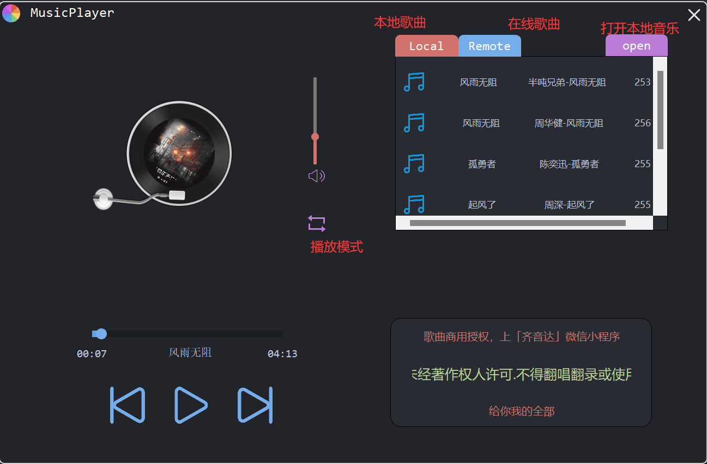
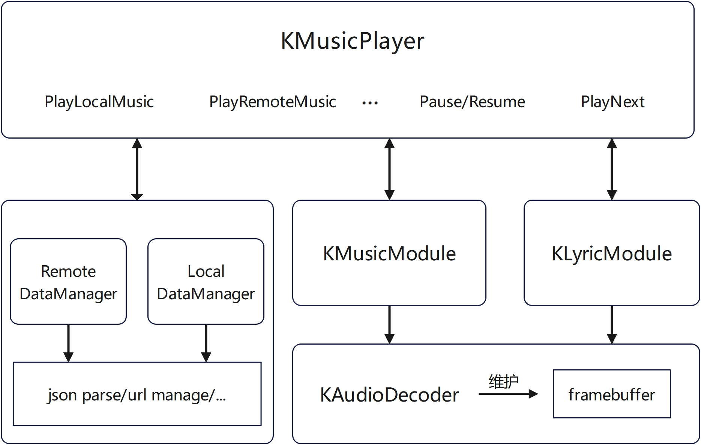

# OneDark主题音乐播放器

## 使用
- 可以直接运行`./Solution/MusicPlayer/MusicPlayer.exe`(debug版)
- 使用VS打开Solution.sln，进行编译运行
- 由于使用了qt网络库，需要将`Qt\Qt5.9.3\Tools\mingw530_32`中的binssleay32.dll和libeay32.dll放到qt的`Qt\Qt5.9.3\5.9.3\msvc2017_64\bin`文件夹中以免出现ssl错误。
- 注意：使用在线播放时，如果没有缓存，需要等待5s左右时间获取资源。



## 功能

- 基本需求
  - [x] 支持MP3格式音乐播放
  - [x] 支持基本的播放控制功能，如播放、暂停、上一曲、下一曲
  - [x] 支持在线音乐播放，通过 HTTP 请求获取音乐资源
  - [x] 支持歌词自动匹配并显示
  - [x] 支持专辑图片自动匹配并显示
  - [x] 支持音量调节、静音功能。
  - [x] 支持播放进度显示,时间显示
  - [x] 支持歌曲切换
- 扩展需求
  - [x] 支持拖动进度条调整进度
  - [x] 支持专辑图片动画,在播放时可同步旋转
  - [x] 支持本地音乐缓存与播放
  - [ ] 支持 MP3 以外的格式播放,如WAV、FLAC、AAC等(还有点小bugQAQ)
  - [x] 支持播放模式选择，如顺序播放、单曲循环、随机播放等
  - [x] 支持最小化托盘
- 其他扩展功能
  - [x] 基于ffmpeg库构建音乐播放模块，扩展性好且支持跨平台性
  - [x] 无边框窗体设计
  - [x] onedark theme主题设计

## TODOs

- 引入多线程设计：音乐解码和播放使用两个线程；使用非阻塞方式进行http资源获取等
- 主题切换功能
- 支持窗口任意缩放
- 使用qt提供的sql模块重构DataManager

## 文件结构

```
Solution
|--Solution.sln  # vs工程文件
|--MusicPlayer/  # musicplayer项目
  |--ffmpeg/  # ffmpeg第三方库
  |--images/  # 图片资源
  |--local/  # 本地歌曲库
  |--remote  # 在线歌曲缓存
  |--*.dll  # ffmpeg动态库
  |--*.exe  # 可执行文件
  |--...  # 源码
```

## MusicPlayer代码架构




### Remote/Local DataManager

#### LocalDataManager

本地文件结构可见`local`文件夹

`LocalDataManager`初始化时读取文件夹下的list.json，解析后读取本地音乐信息。

### RemoteDataManager

**这里为了方便，提前将远程服务器中根目录下的文件夹名写在了代码中**。初始化时会逐个读取文件夹下的json文件初始化音乐信息。

首次播放音乐时需要一段时间获取资源。获取的资源会存放在remote文件夹中作为缓存。remote文件夹结构和远程服务器文件夹结构相同。

### MusicModule/LyricModule

MusicModule主要负责音乐的播放/暂停功能；LyricModule主要负责歌词的匹配功能。

其中，MusicModule每隔一段时间发送信号给LyricModule以实现歌词匹配功能。

### MusicPlayer

最顶层类，组合各个模块进行功能封装


